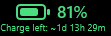

# Razer BlackShark V2 Pro (2023) Rainmeter Battery Skin

`BlackShark V2 Pro (2023) Rainmeter Battery Skin` is a lightweight Rainmeter skin for the `Razer BlackShark V2 Pro (2023)` that reads battery data from the local `Razer Synapse 3` log when the headset is connected over the wireless dongle.

It is designed for an always-visible desktop widget: small footprint, fast glanceability, and no need to open Synapse just to check battery state.

## Features

- Compact battery icon with percentage display
- Charging indicator with vector lightning bolt
- Stale-data indicator with question mark
- Explicit disconnected state that preserves the last known battery reading
- Battery color bands: `0-10%` red, `11-20%` orange, `21-30%` yellow, `31-100%` green
- Estimated remaining charge time based on robust local Synapse discharge history across short-, medium-, and longer-term usage
- Optional built-in preview states for live UI testing
- Lightweight polling with a fast lifecycle check, slower battery polling, and longer-interval history rescans

## Requirements

- Windows
- Rainmeter
- Razer Synapse 3
- At least one Synapse battery entry for the headset

## Install

1. Download or clone this repository.
2. Copy `BlackSharkBattery.ini` and the `@Resources` folder into:
   `C:\Users\<YourUser>\Documents\Rainmeter\Skins\BlackSharkBattery`
3. In Rainmeter, refresh skins.
4. Load `BlackSharkBattery.ini`.
5. If the skin shows no data yet, open Synapse once with the headset powered on and connected.

## How It Works

- By default, the skin reads `C:\Users\<YourUser>\AppData\Local\Razer\Synapse3\Log\Razer Synapse 3.log`
- It only reads the tail of the live log to stay lightweight.
- It can react more quickly to headset on/off transitions by checking for log changes frequently, while keeping the heavier battery parse on a slower cadence.
- Battery-time estimation uses recent and longer-term local Synapse history, but now leans more heavily on broader history so short reconnect anomalies have less impact.
- Only discharge sessions are considered for the estimate.
- Long gaps, reconnect rebounds, and short outlier sessions are filtered out so the estimate is less sensitive to temporary percentage corrections.

## Display States

- Live battery with color-coded fill
- Charging with a lightning bolt indicator
- Stale with a `?` marker when the last reading is old
- Disconnected with the last known battery reading preserved in grey

## Preview States

Set `ShowDeveloperPreviews=1` in `BlackSharkBattery.ini` and refresh the skin to expose built-in preview states in the right-click menu. Release builds ship with that flag set to `0`.

- `Preview Green`
- `Preview Yellow`
- `Preview Orange`
- `Preview Red`
- `Preview Charging`
- `Preview Stale Green`
- `Preview Stale Yellow`
- `Preview Stale Orange`
- `Preview Stale Red`
- `Preview Full Charge`
- `Preview Disconnected`
- `Preview No Estimate`
- `Return To Live`

Preview charge-time values use the configured `PreviewFullChargeHours` baseline in `BlackSharkBattery.ini`.

## Notes

- `Stale` means the last Synapse battery reading is older than the configured `StaleMinutes` threshold.
- `Disconnected` means Synapse logged an explicit headset removal event. In that state, the widget keeps the last known battery value but greys the whole display and replaces the lower line with `Disconnected`.
- When there is not enough discharge history yet, the widget displays `Charge left: Insufficient logs`.
- Live stale readings are marked as uncertain and do not show a live estimate.
- Left-click the widget to force a refresh.
- Right-click the widget to open the Synapse log folder or the skin folder.

## Repository Layout

- `BlackSharkBattery.ini`: Rainmeter skin definition
- `@Resources/BlackSharkBattery.lua`: Synapse log parsing, battery-state logic, estimate logic, and preview helpers
- `assets/BlacksharkBattery.png`: screenshot used in this README
- `README.md`: install and usage documentation
- `LICENSE`: repository license

## Attribution

Created and maintained by `darojax`.

Developed with implementation assistance from `OpenAI Codex`.

## License

MIT
