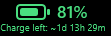

# Razer BlackShark V2 Pro (2023) Rainmeter Battery Skin

`BlackShark V2 Pro (2023) Rainmeter Battery Skin` is a lightweight Rainmeter skin for the `Razer BlackShark V2 Pro (2023)` that reads battery data from the local `Razer Synapse 3` or `Razer Synapse 4` logs when the headset is connected over the wireless dongle.

It is designed for an always-visible desktop widget: small footprint, fast glanceability, and no need to open Synapse just to check battery state.

## Features

- Compact battery icon with percentage display
- Charging indicator with vector lightning bolt
- Stale-data indicator with question mark
- Explicit disconnected state that preserves the last known battery reading
- Battery color bands: `0-10%` red, `11-20%` orange, `21-30%` yellow, `31-100%` green
- Adaptive remaining-charge estimate that starts with Razer's official 70-hour rating and progressively replaces it with local discharge history
- Optional built-in preview states for live UI testing
- Lightweight polling with a fast lifecycle check, slower battery polling, and longer-interval history rescans

## Requirements

- Windows
- Rainmeter
- Razer Synapse 3 or 4
- At least one Synapse battery entry for the headset

## Install

1. Download or clone this repository.
2. Copy `BlackSharkBattery.ini` and the `@Resources` folder into:
   `C:\Users\<YourUser>\Documents\Rainmeter\Skins\BlackSharkBattery`
3. In Rainmeter, refresh skins.
4. Load `BlackSharkBattery.ini`.
5. If the skin shows no data yet, open Synapse once with the headset powered on and connected.

## How It Works

- By default, the skin auto-detects the active Synapse log source:
  - `C:\Users\<YourUser>\AppData\Local\Razer\Synapse3\Log\Razer Synapse 3.log` for Synapse 3
  - `C:\Users\<YourUser>\AppData\Local\Razer\RazerAppEngine\User Data\Logs\systray_systrayv2*.log` for Synapse 4
- It only reads a bounded tail of each live log during normal polling to stay lightweight; full files are reserved for infrequent history refreshes.
- For Synapse 4, it scans all discovered `systray_systrayv2*.log` files and uses the newest headset snapshot found.
- Synapse 4 can report `NoCharge_BatteryFull` even when the headset is not full, so the skin can infer charging from a recent rising battery percentage using `Synapse4ChargingInferenceHours`.
- Synapse 4 `off` readings are treated as an offline headset state rather than as a live non-charging battery reading.
- It can react more quickly to headset on/off transitions by checking for log changes frequently, while keeping the heavier battery parse on a slower cadence.
- Battery-time estimation begins with Razer's official "up to 70 hours" specification when no useful local history exists.
- As valid discharge sessions accumulate, the estimate blends in local observations according to evidence confidence. Once the history has sufficient battery drop, elapsed time, and sessions, the manufacturer baseline contributes nothing.
- Recent, medium-term, and longer-term history are combined, with broader history weighted more heavily so short reconnect anomalies have less impact.
- Only discharge sessions are considered for the estimate.
- Long gaps, reconnect rebounds, and short outlier sessions are filtered out so the estimate is less sensitive to temporary percentage corrections.

## Display States

- Live battery with color-coded fill
- Charging with a lightning bolt indicator
- Stale with a `?` marker when the last reading is old
- Disconnected with the last known battery reading preserved in grey
- Headset off with the last known battery reading preserved in grey

## Preview States

Set `ShowDeveloperPreviews=1` in `BlackSharkBattery.ini` and refresh the skin to expose built-in preview states in the right-click menu. Release builds ship with that flag set to `0`.

- `Preview Green`
- `Preview Yellow`
- `Preview Orange`
- `Preview Red`
- `Preview Charging`
- `Preview Stale Green`
- `Preview Stale Yellow`
- `Preview Stale Orange`
- `Preview Stale Red`
- `Preview Full Charge`
- `Preview Disconnected`
- `Preview No Estimate`
- `Return To Live`

Preview charge-time values use the configured `PreviewFullChargeHours` baseline in `BlackSharkBattery.ini`.

## Notes

- `Stale` means the last Synapse battery reading is older than the configured `StaleMinutes` threshold.
- `Disconnected` means Synapse reported the headset as removed or absent from the latest live device snapshot. In that state, the widget keeps the last known battery value but greys the whole display and replaces the lower line with `Disconnected`.
- `Headset off` means Synapse 4 reported the headset power state as `off`. In that state, the widget keeps the last known battery value but greys the whole display.
- When discharge history is sparse, the widget still shows the best available approximation and marks it with `?`; the tooltip indicates how much of the estimate comes from local history.
- Live stale readings are marked as uncertain and do not show a live estimate.
- Left-click the widget to force a refresh.
- Right-click the widget to open the Synapse log folder or the skin folder.

## Estimation Settings

- `ManufacturerBatteryLifeHours=70` controls the initial full-charge prior. The default comes from [Razer's published "up to 70 hours" rating for the 2023 model](https://mysupport.razer.com/app/answers/detail/a_id/13060/).
- `PreviewFullChargeHours` affects developer previews only.
- Estimation automatically transitions from the manufacturer prior to measured local discharge behavior; no manual calibration is required.

## Development Tests

Install the development dependencies with `python -m pip install -r requirements-dev.txt`, then run `python -m pytest -q`.

## Repository Layout

- `BlackSharkBattery.ini`: Rainmeter skin definition
- `@Resources/BlackSharkBattery.lua`: Synapse log parsing, battery-state logic, estimate logic, and preview helpers
- `assets/BlacksharkBattery.png`: screenshot used in this README
- `README.md`: install and usage documentation
- `LICENSE`: repository license

## Attribution

Created and maintained by `darojax`.

Developed with implementation assistance from `OpenAI Codex`.

## License

MIT
